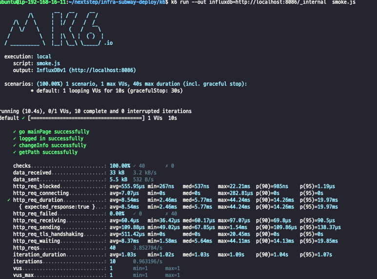
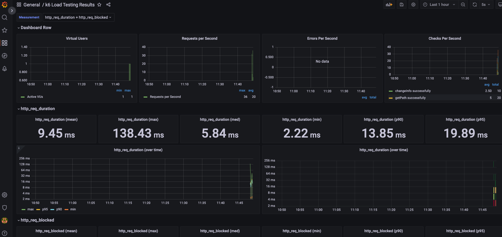
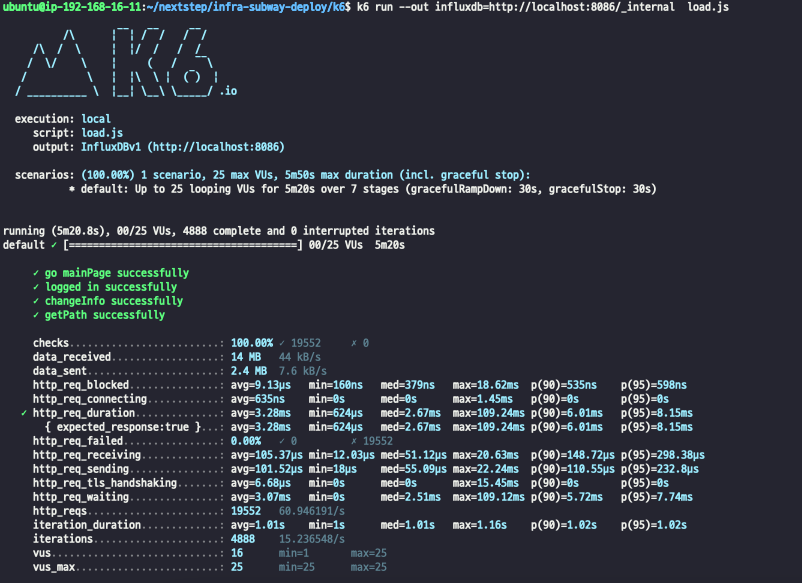
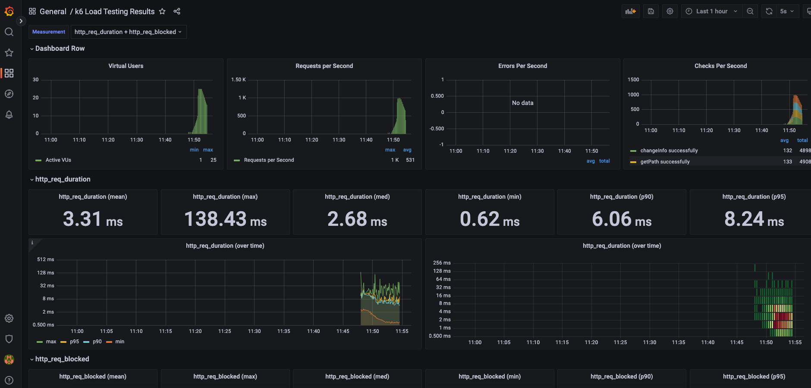
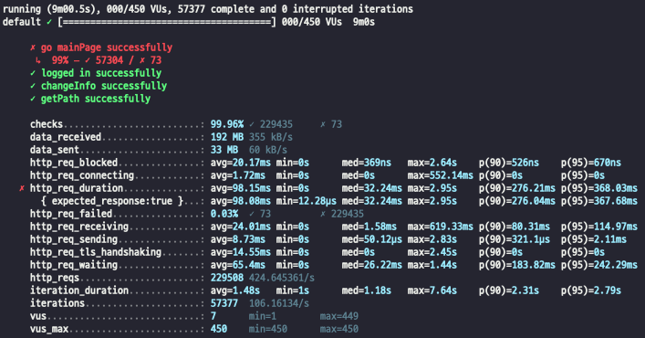
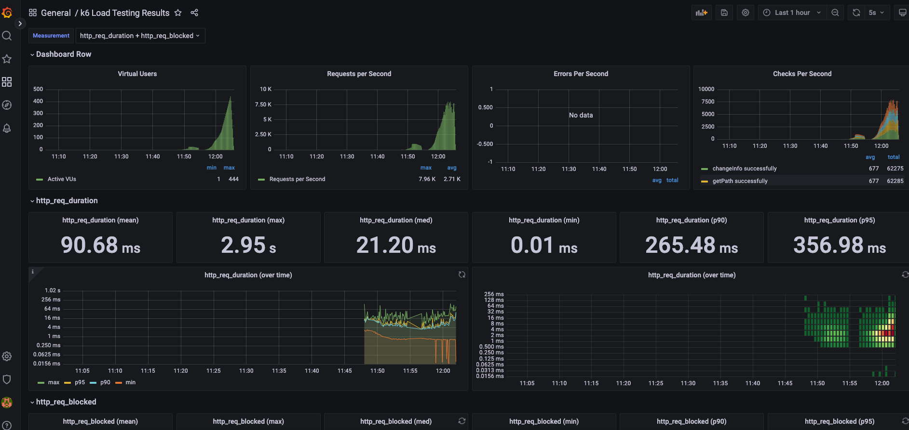

<p align="center">
    
</p>
<p align="center">
  
  
  <a href="https://edu.nextstep.camp/c/R89PYi5H" alt="nextstep atdd">
    
  </a>
  
</p>

<br>

# 인프라공방 샘플 서비스 - 지하철 노선도

<br>

## 🚀 Getting Started

### Install
#### npm 설치
```
cd frontend
npm install
```
> `frontend` 디렉토리에서 수행해야 합니다.

### Usage
#### webpack server 구동
```
npm run dev
```
#### application 구동
```
./gradlew clean build
```
<br>

## 미션

* 미션 진행 후에 아래 질문의 답을 작성하여 PR을 보내주세요.


### 1단계 - 화면 응답 개선하기
1. 성능 개선 결과를 공유해주세요 (Smoke, Load, Stress 테스트 결과)





|  | data_sent | http_req_blocked | http_req_connecting | http_req_duration | http_req_receiving | http_req_sending | http_req_tls_handshaking | http_req_waiting |
| :----: | :----: |:----------------:|:-------------------:|:-----------------:|:------------------:|:----------------:|:------------------------:|:----------------:|
| 개선전 | 33 kb |      784.47      |        19.28        |       36.55       |       70.18        |      26.78       |          461.97          |      36.45       |
| 개선후 | 5.5kb |      555.95      |        7.07         |       8.54        |        60.4        |      109.88      |          511.42          |       8.37       |
| 결과 | -27.5 |      -231.5      |       -12.21        |      -28.01       |       -10.22       |      +83.1       |          +49.45          |      -28.08      |






|  | data_sent | http_req_blocked | http_req_connecting | http_req_duration | http_req_receiving | http_req_sending | http_req_tls_handshaking | http_req_waiting |
| :----: |:---------:|:----------------:|:-------------------:|:-----------------:|:------------------:|:----------------:|:------------------------:|:----------------:|
| 개선전 |   4.4MB   |     12.19us      |        706ns        |      3.48ms       |      85.71us       |     27.99us      |          5.75us          |      3.37ms      |
| 개선후 |   2.4MB | 9.13 |         635         |       3.28        | 105.37 | 101.52 | 6.68 | 3.07 |      
| 결과 |   -2MB |   -3.06 |         -71         |       -0.2        | +19.66 | 73.53 | +0.93 | -0.3 |






|  |    data_sent     | http_req_blocked | http_req_connecting | http_req_duration | http_req_receiving | http_req_sending | http_req_tls_handshaking | http_req_waiting |
| :----: |:----------------:|:----------------:|:-------------------:|:-----------------:|:------------------:|:----------------:|:------------------------:|:----------------:|
| 개선전 |       54MB       | 13.18 | 1.63 | 108.43 | 1.21 | 9.98 | 5.46 | 97.24 |
| 개선후 |       33MB       | 20.17 | 1.72 | 98.15 | 24.01 | 8.73 | 14.55 | 65.4 | 
| 결과 |       -21        | +6.99 | +0.09 | -10.28 | +22.8 | -1.25 | +9.09 | -31.84| 


2. 어떤 부분을 개선해보셨나요? 과정을 설명해주세요

- nginx.conf 에서 gzip 설정

```shell
gzip on; ## http 블록 수준에서 gzip 압축 활성화
  gzip_comp_level 9;
  gzip_vary on;
  gzip_types
	  text/plain
	  text/css
	  application/json
	  application/x-javascript
	  application/javascript
	  text/xml
	  application/xml
	  application/rss+xml
	  text/javascript
	  image/svg+xml
	  application/vnd.ms-fontobject
	  application/x-font-ttf
	  font/opentype;
```

- nginx cache 설정

```shell
location ~* \.(?:css|js|gif|png|jpg|jpeg)$ {
            proxy_pass http://app;

            ## 캐시 설정 적용 및 헤더에 추가
            # 캐시 존을 설정 (캐시 이름)
            proxy_cache mycache;
            # X-Proxy-Cache 헤더에 HIT, MISS, BYPASS와 같은 캐시 적중 상태정보가 설정
            add_header X-Proxy-Cache $upstream_cache_status;
            # 200 302 코드는 20분간 캐싱
            proxy_cache_valid 200 302 10m;
            # 만료기간을 1 달로 설정
            expires 1M;
            # access log 를 찍지 않는다.
            access_log off;
     }
```

- http2 설정

```shell
listen 443 ssl http2;
```

- redis 설정

```java
@EnableCaching
@Configuration
public class CacheConfig extends CachingConfigurerSupport {

    @Autowired
    RedisConnectionFactory connectionFactory;

    @Bean
    public CacheManager redisCacheManager() {
        RedisCacheConfiguration redisCacheConfiguration = RedisCacheConfiguration.defaultCacheConfig()
            .serializeKeysWith(
                RedisSerializationContext.SerializationPair.fromSerializer(new StringRedisSerializer()))
            .serializeValuesWith(RedisSerializationContext
                .SerializationPair
                .fromSerializer(new GenericJackson2JsonRedisSerializer()));

        RedisCacheManager redisCacheManager = RedisCacheManager.RedisCacheManagerBuilder.
            fromConnectionFactory(connectionFactory).cacheDefaults(redisCacheConfiguration).build();
        return redisCacheManager;
    }

}
```


---

### 2단계 - 스케일 아웃

1. Launch Template 링크를 공유해주세요.

2. cpu 부하 실행 후 EC2 추가생성 결과를 공유해주세요. (Cloudwatch 캡쳐)

```sh
$ stress -c 2
```

3. 성능 개선 결과를 공유해주세요 (Smoke, Load, Stress 테스트 결과)

---
### [추가] 1단계 - 쿠버네티스로 구성하기
1. 클러스터를 어떻게 구성했는지 알려주세요~ (마스터 노드 : n 대, 워커 노드 n대)

2. 스트레스 테스트 결과를 공유해주세요 (기존에 container 한대 운영시 한계점도 같이 공유해주세요)

3. 현재 워커노드에서 몇대의 컨테이너를 운영중인지 공유해주세요

---

### [추가] 2단계 - 클러스터 운영하기

1. kibana 링크를 알려주세요

2. grafana 링크를 알려주세요

3. 지하철 노선도는 어느정도로 requests를 설정하는게 적절한가요?

4. t3.large로 구성할 경우 Node의 LimitRange, ResourceQuota는 어느정도로 설정하는게 적절한가요?

5. 부하테스트를 고려해볼 때 Pod은 몇대정도로 구성해두는게 좋다고 생각하나요?

6. Spinaker 링크를 알려주세요.
