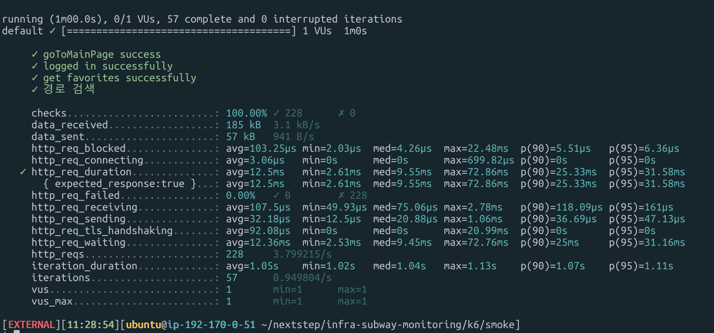
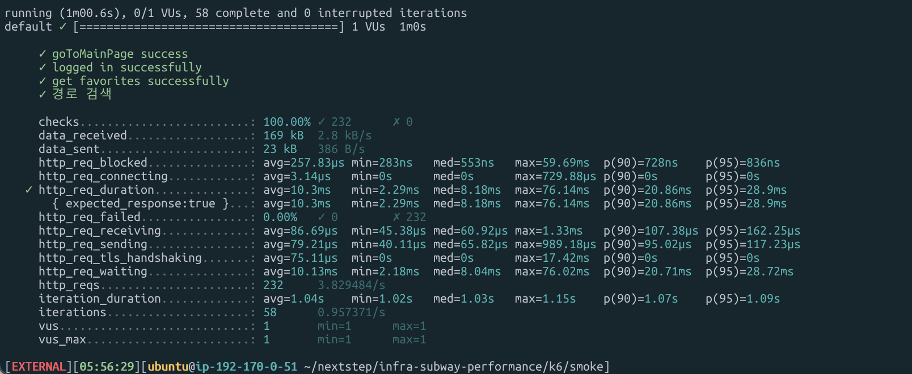
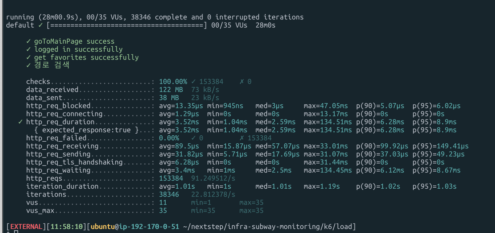
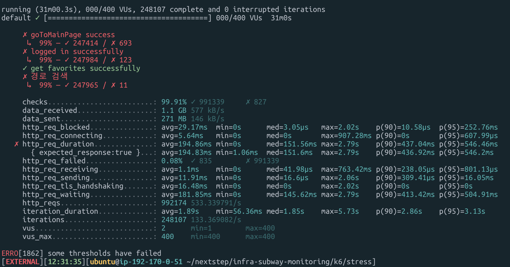
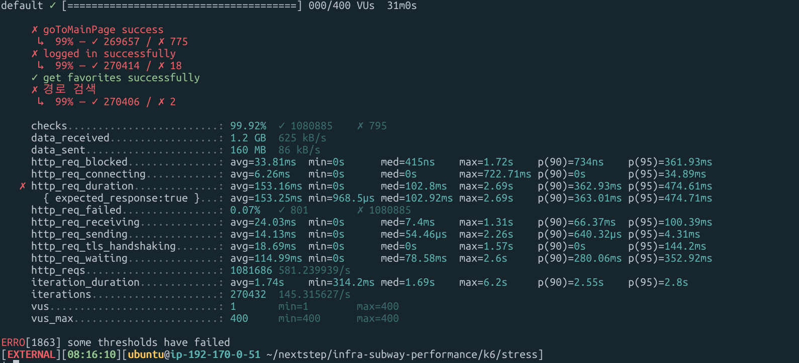

<p align="center">
    
</p>
<p align="center">
  
  
  <a href="https://edu.nextstep.camp/c/R89PYi5H" alt="nextstep atdd">
    
  </a>
  
</p>

<br>

# 인프라공방 샘플 서비스 - 지하철 노선도

<br>

## 🚀 Getting Started

### Install
#### npm 설치
```
cd frontend
npm install
```
> `frontend` 디렉토리에서 수행해야 합니다.

### Usage
#### webpack server 구동
```
npm run dev
```
#### application 구동
```
./gradlew clean build
```
<br>

## 미션

* 미션 진행 후에 아래 질문의 답을 작성하여 PR을 보내주세요.


### 1단계 - 화면 응답 개선하기
1. 성능 개선 결과를 공유해주세요 (Smoke, Load, Stress 테스트 결과)

|             |지하철 노선도(개선전)| 지하철 노선도(개선후)| 서울교통공사 | 네이버지도 | 카카오맵 |
|-------------|----------------|------------|-------------|-----------|---------|
| Performance |  33            | 49         |   43        | 59        | 69      |
| FCP         | 14.6s          | 2.5s       | 6.4s        | 2.2s      | 1.7s    |
| Speed Index | 14.6s          | 4.4s       | 7.7s        | 5.6s      | 6.4s    | 
| LCP         | 15.1s          | 5.7s       | 6.6s        | 8.3s      | 6.4s    |
| TTI         | 15.1s          | 5.8s       | 8.4s        | 5.9s      | 4.1s    | 
| TBT         | 490ms          | 860ms      | 420ms       | 290ms     | 30ms    |
| CLS         | 0.042          | 0.04       | 0           | 0.03      | 0.005   | 


* Smoke
* 
* 

* Load
* 
* 

* Stress
* 
* 

3. 어떤 부분을 개선해보셨나요? 과정을 설명해주세요
- @Transactional(readOnly=true) 읽기전용 트랜잭션 처리
- Spring Data Cache 적용
- nginx Reverse Proxy 개선
  - gzip 압축,
  - cache 적용
  - TLS, HTTP/2 설정
- js 파일에 async 속성 추가

---

### 2단계 - 스케일 아웃

1. Launch Template 링크를 공유해주세요.

2. cpu 부하 실행 후 EC2 추가생성 결과를 공유해주세요. (Cloudwatch 캡쳐)

```sh
$ stress -c 2
```

3. 성능 개선 결과를 공유해주세요 (Smoke, Load, Stress 테스트 결과)

