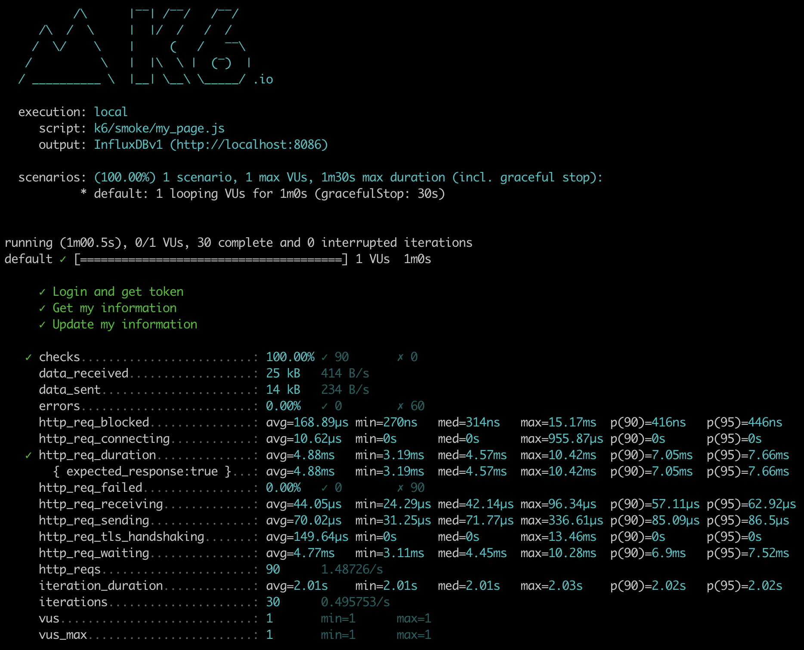
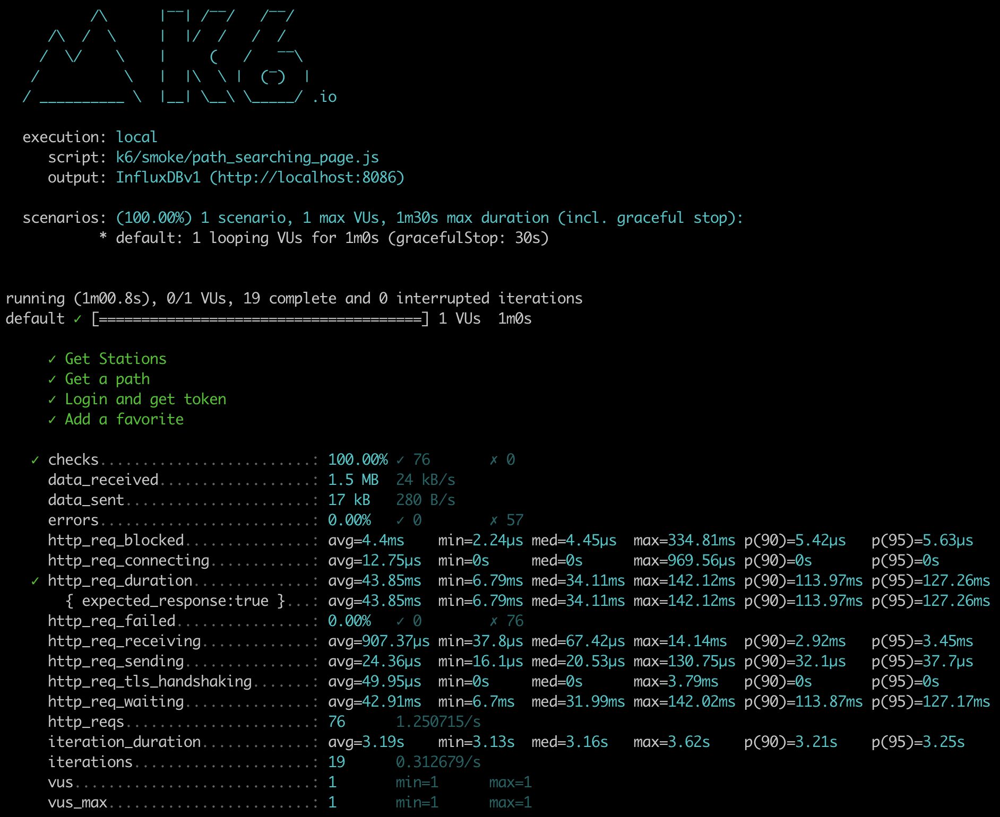
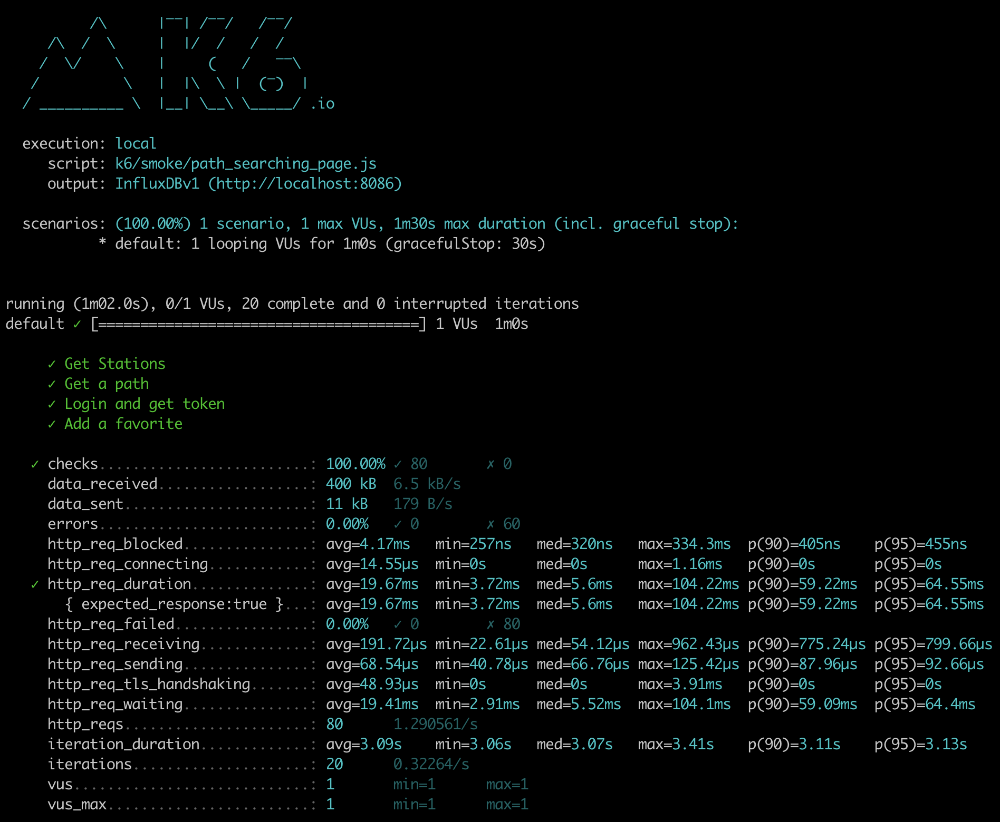
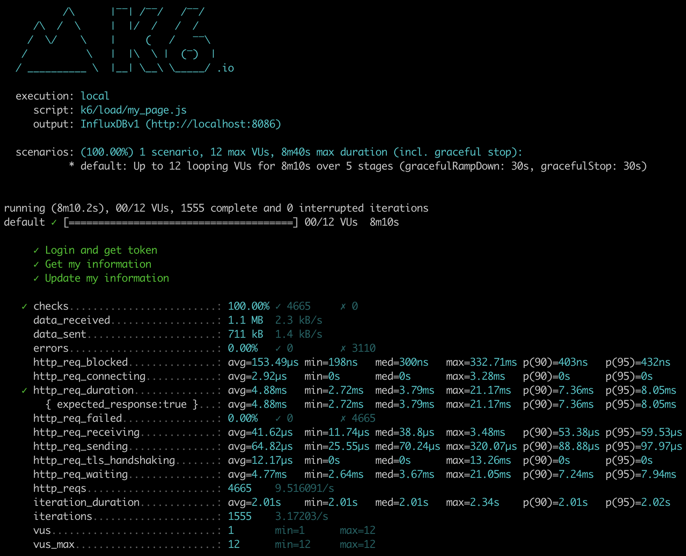
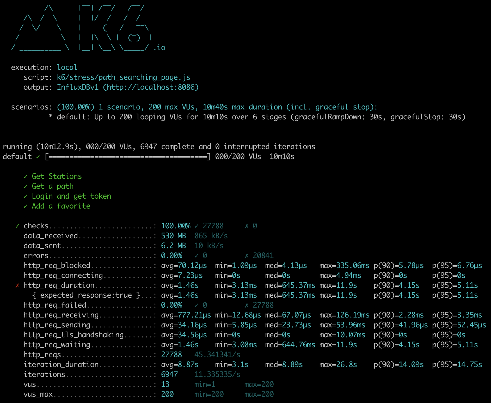
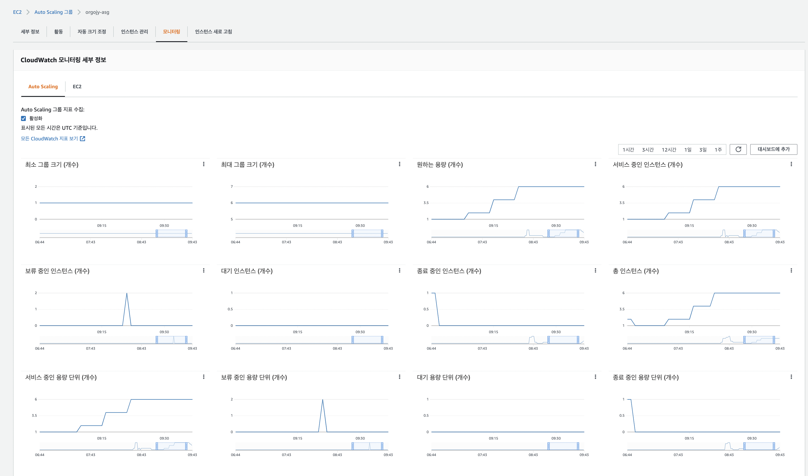
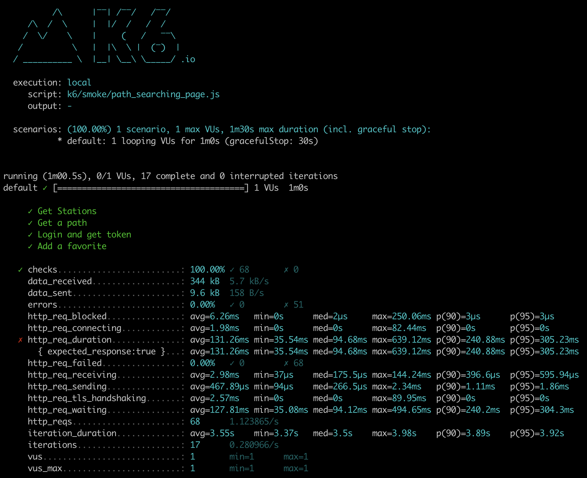
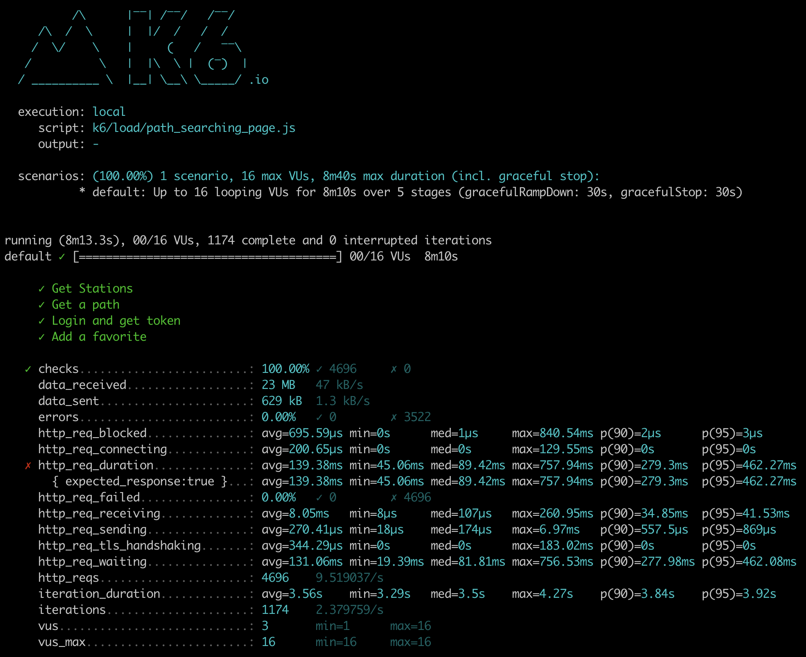
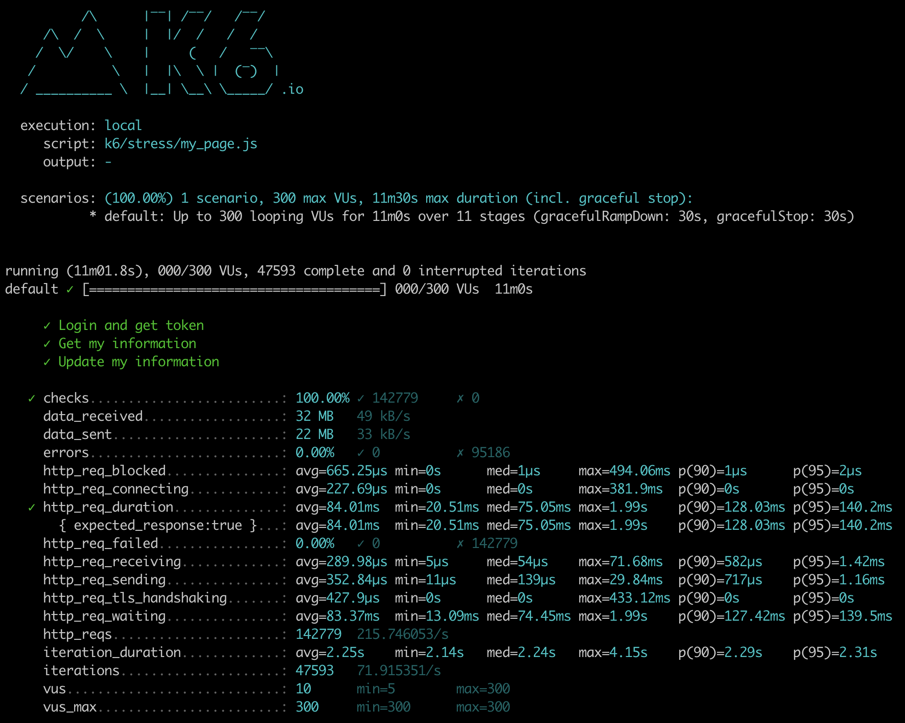
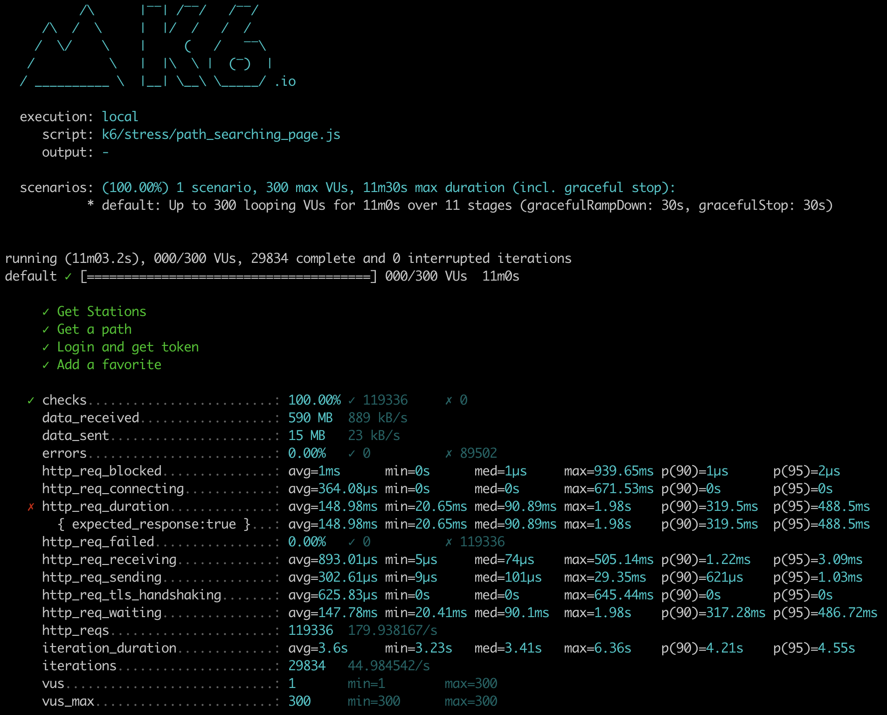

<p align="center">
    
</p>
<p align="center">
  
  
  <a href="https://edu.nextstep.camp/c/R89PYi5H" alt="nextstep atdd">
    
  </a>
  
</p>

<br>

# 인프라공방 샘플 서비스 - 지하철 노선도

<br>

## 🚀 Getting Started

### Install

#### npm 설치

```
cd frontend
npm install
```

> `frontend` 디렉토리에서 수행해야 합니다.

### Usage

#### webpack server 구동

```
npm run dev
```

#### application 구동

```
./gradlew clean build
```

<br>

## 미션

* 미션 진행 후에 아래 질문의 답을 작성하여 PR을 보내주세요.

### 1단계 - 화면 응답 개선하기

1. 성능 개선 결과를 공유해주세요 (Smoke, Load, Stress 테스트 결과)

#### Smoke Test

"My Page"

- Before  
- After Optimization  

"Path Searching Page"

- Before  
- After Optimization  

#### Load Test

"My Page"

- Before  
- After Optimization  

"Path Searching Page"

- Before  
- After Optimization  

#### Stress Test

"My Page"

- Before  
- After Optimization  

"Path Searching Page"

- Before  
- After Optimization  

2. 어떤 부분을 개선해보셨나요? 과정을 설명해주세요  
   2.1. Reverse Proxy 개선하기 with nginx
    1. gzip 압축
    2. cache 적용
    3. TLS, HTTP/2 설정

   2.2. WAS 성능 개선하기
    1. Spring Data Cache 적용
    2. 사용 Query에 직접 캐시 반영
    3. API 응답 객체 필드 최적화

**Smoke/Load/Stress Test 개선 결과 총평**

- Smoke/Load/Stress Test 과정에서 전반적으로 성능 개선이 있었습니다.
- 하지만 Stress Test 에서는 개선하고 나서도 시나리오에 맞는 테스트 트래픽을 처리하기에 버거움이 있어서 목표로 했던 'http_req_duration' 을 많이 초과하여
  목표을 달성하지 못했습니다.
- 이후에 Scale-out(ASG, ...) 이나 Scale-up(Instance type upscale, ...)로 트래픽을 병행 처리하면 더 좋은 트래픽 개선을 가질 수 있을
  것이라고 추정합니다.

---

### 2단계 - 스케일 아웃

``` text
급격한 트래픽을 처리하기 위해서 다음 목적으로 구성
    1. 많은 트래픽을 물리적으로 처리하기 위한 Scale-out Maximum 6대 
    2. 증설 인스턴스의 빠른 서비스 제공을 위한 Target Group 의 빠른 Health Check

ASG: orgojy-asg
    최소용량: 1
    최대용량: 6
    동적크기조정정책
        - 정책 유형: 대상 추적 크기 조정
        - 활성화 또는 비활성화? 활성
        - 다음 경우에 정책 실행: 평균 CPU 사용률을(를) 50(으)로 유지하는 데 필요한 경우
        - 작업 수행: 필요에 따라 용량 단위 추가 또는 제거
        - 인스턴스 요구 사항: 300초(지표에 포함하기 전 워밍업 시간)
        - 축소: 활성
ALB: orgojy-alb
    - Target Group: orgojy-tg
        - Targets: (1) 443 -> 8080
        - Health Checks
            - Protocol: HTTP
            - Healthy threshold: 2 consecutive health check successes
            - Unhealthy threshold: 2 consecutive health check failures
            - Timeout: 9 seconds
            - Interval: 10 seconds
            - Success codes: 200
```

1. Launch Template 링크를 공유해주세요.

- [LT-orgojy-webservice (lt-04079e0b0f96eae13)](https://ap-northeast-2.console.aws.amazon.com/ec2/v2/home?region=ap-northeast-2#LaunchTemplateDetails:launchTemplateId=lt-04079e0b0f96eae13)

2. cpu 부하 실행 후 EC2 추가생성 결과를 공유해주세요. (Cloudwatch 캡쳐)

```sh
$ stress -c 2
```



3. 성능 개선 결과를 공유해주세요 (Smoke, Load, Stress 테스트 결과)

#### Smoke Test

"My Page"

- After Optimization  
- After ASG  

ASG 반영 후, 개선점

- ASG 반영 후, ALB를 타기 때문에 트래픽에 대한 전체적인 성능 저하가 발생한 것으로 보인다.
- 서비스에는 큰 차이를 느끼지는 못하는 정도의 저하이다.

"Path Searching Page"

- After Optimization  
- After ASG  

ASG 반영 후, 개선점

- ASG 반영 후, ALB를 타기 때문에 트래픽에 대한 전체적인 성능 저하가 발생한 것으로 보인다.
- 서비스에는 큰 차이를 느끼지는 못하는 정도의 저하이다.

#### Load Test

"My Page"

- After Optimization  
- After ASG  

ASG 반영 후, 개선점

- ASG 반영 후, ALB를 타기 때문에 트래픽에 대한 전체적인 성능 저하가 발생한 것으로 보인다.
- 하지만, VU 의 수치가 적어서 그렇지 트래픽이 많아질 수록 유의미하게 Smoke Test 와 비교되는 성능 개선이 보인다.

"Path Searching Page"

- After Optimization  
- After ASG  

ASG 반영 후, 개선점

- ASG 반영 후, ALB를 타기 때문에 트래픽에 대한 전체적인 성능 저하가 발생한 것으로 보인다.
- 하지만, VU 의 수치가 적어서 그렇지 트래픽이 많아질 수록 유의미하게 Smoke Test 와 비교되는 성능 개선이 보인다.

#### Stress Test

"My Page"

- After Optimization  
- After ASG  

ASG 반영 후, 개선점

- 평균 응답시간: 199.78ms -> 84.01ms (68% 개선)
- 중앙 응답시간: 127.15ms -> 75.05ms (41% 개선)
- 90% 요청 응답시간 경계값: 385.15ms -> 128.03ms (67% 개선)
- 95% 요청 응답시간 경계값: 753.47ms -> 140.2ms (81% 개선)

"Path Searching Page"

- After Optimization  
- After ASG  

ASG 반영 후, 개선점

- 평균 응답시간: 1.62s -> 148.98ms (91% 개선)
- 중앙 응답시간: 503.54ms -> 90.89ms (82% 개선)
- 90% 요청 응답시간 경계값: 5.09s -> 319.5ms (94% 개선)
- 95% 요청 응답시간 경계값: 6.41s -> 488.5ms (92% 개선)

---

### [추가] 1단계 - 쿠버네티스로 구성하기

1. 클러스터를 어떻게 구성했는지 알려주세요~ (마스터 노드 : n 대, 워커 노드 n대)

2. 스트레스 테스트 결과를 공유해주세요 (기존에 container 한대 운영시 한계점도 같이 공유해주세요)

3. 현재 워커노드에서 몇대의 컨테이너를 운영중인지 공유해주세요

---

### [추가] 2단계 - 클러스터 운영하기

1. kibana 링크를 알려주세요

2. grafana 링크를 알려주세요

3. 지하철 노선도는 어느정도로 requests를 설정하는게 적절한가요?

4. t3.large로 구성할 경우 Node의 LimitRange, ResourceQuota는 어느정도로 설정하는게 적절한가요?

5. 부하테스트를 고려해볼 때 Pod은 몇대정도로 구성해두는게 좋다고 생각하나요?

6. Spinaker 링크를 알려주세요.
