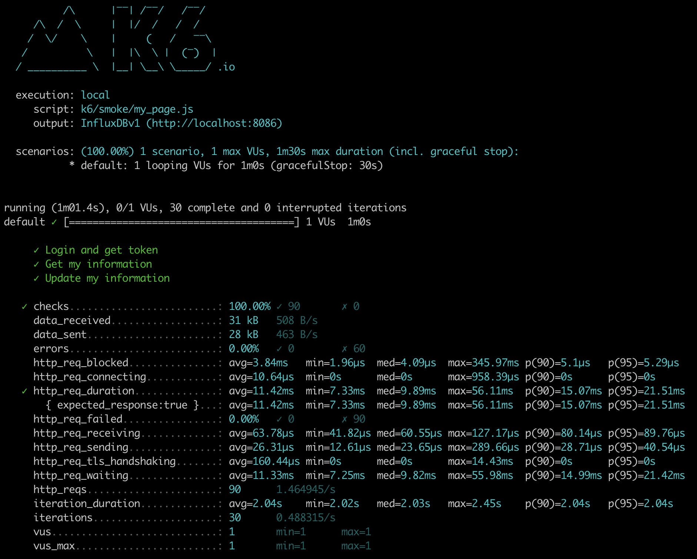
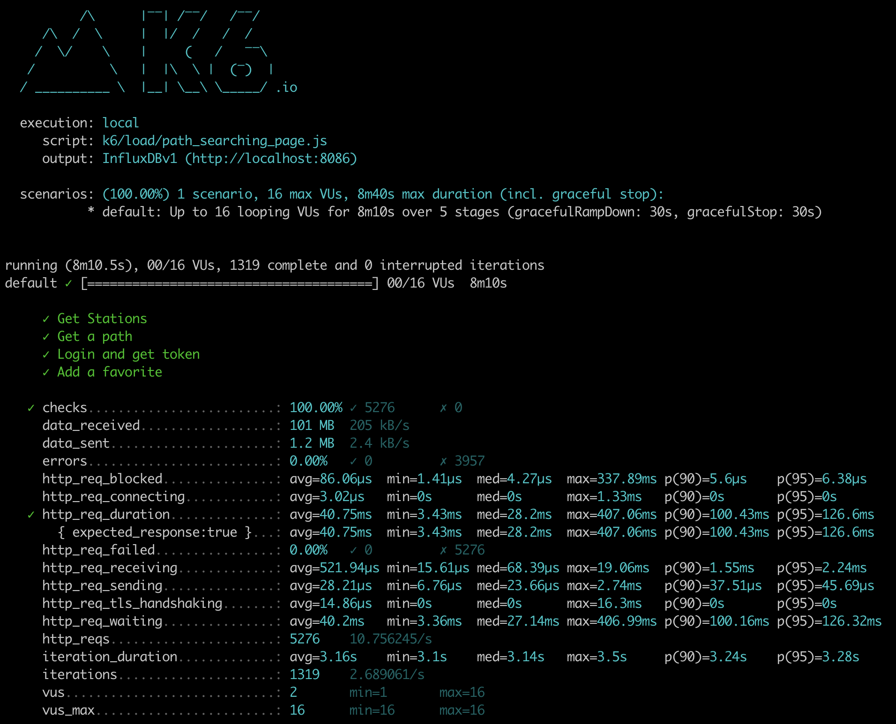
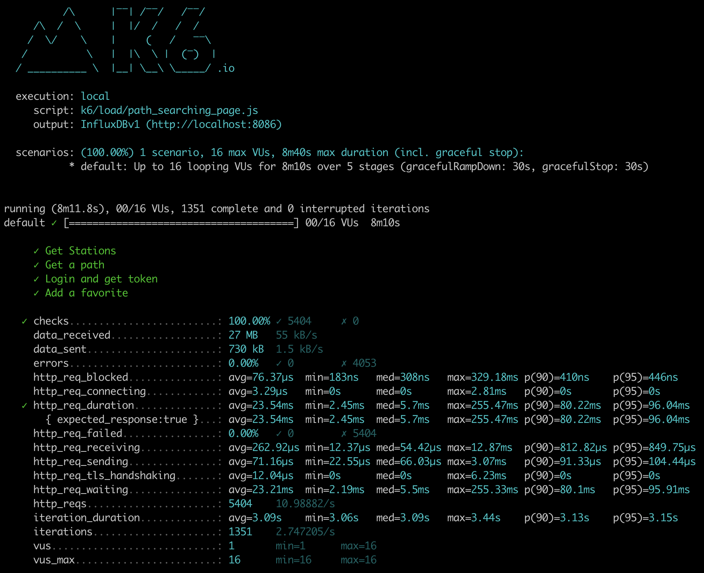
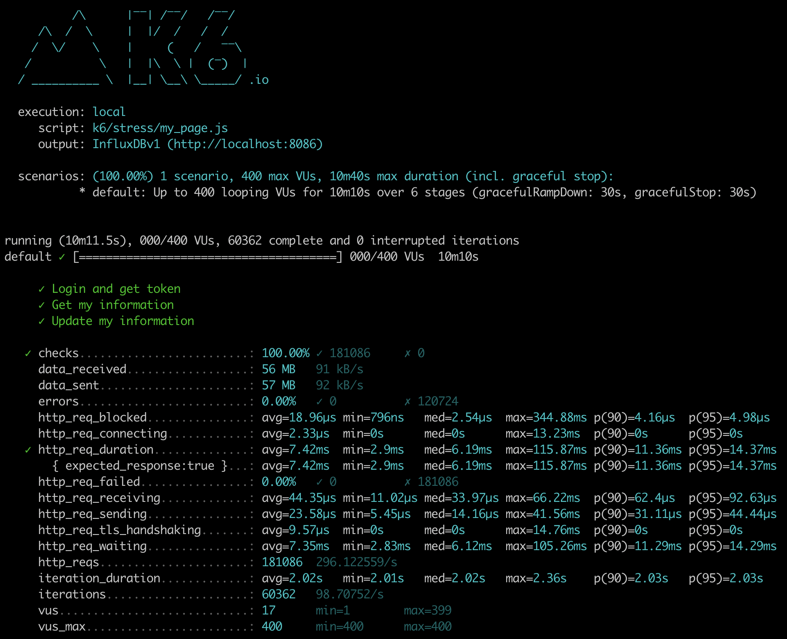
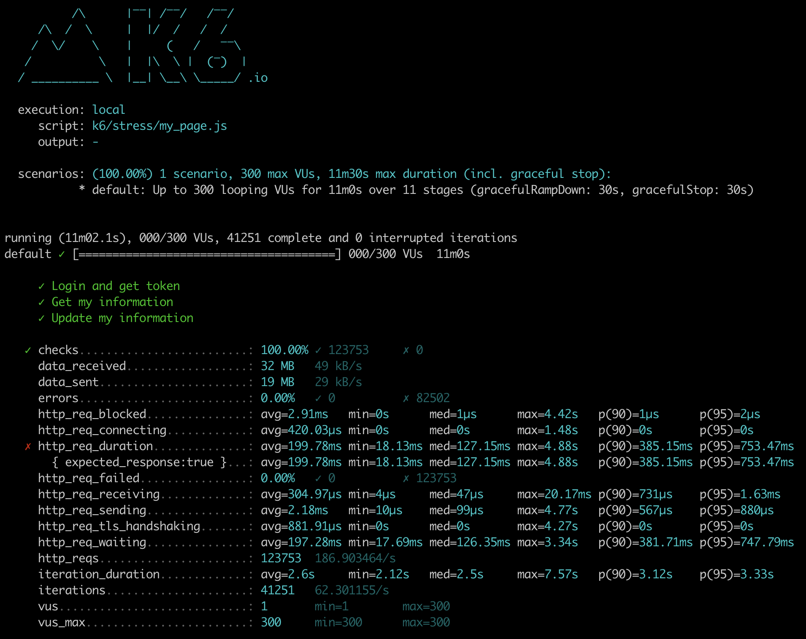
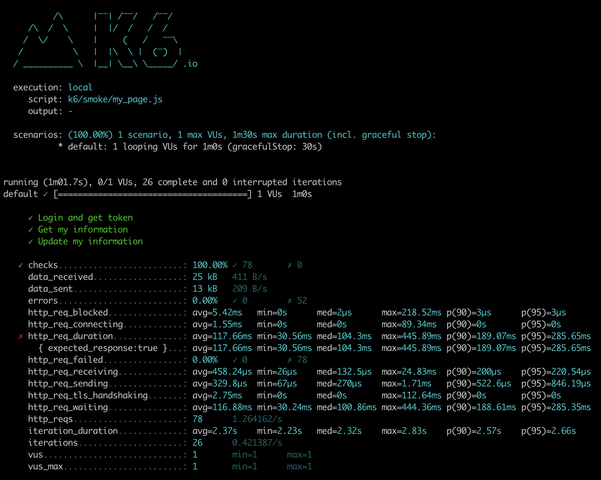
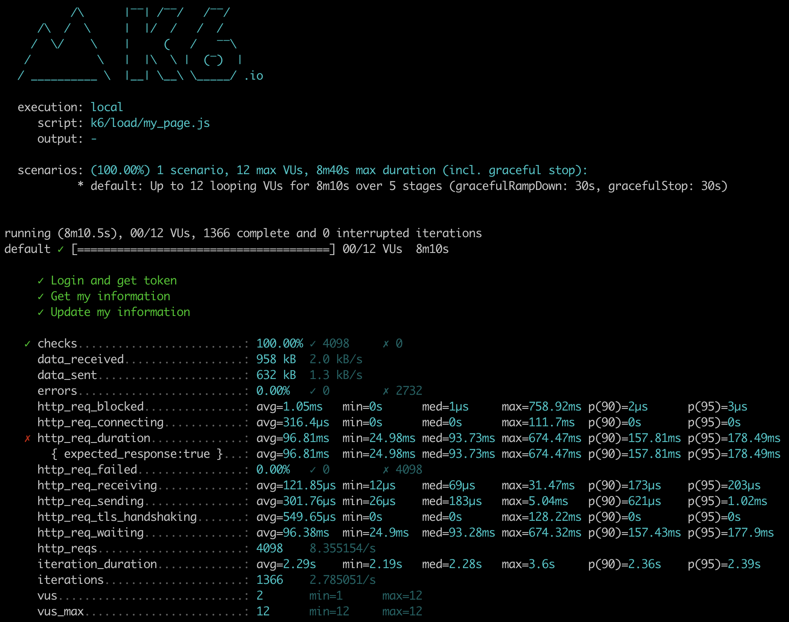

<p align="center">
    
</p>
<p align="center">
  
  
  <a href="https://edu.nextstep.camp/c/R89PYi5H" alt="nextstep atdd">
    
  </a>
  
</p>

<br>

# 인프라공방 샘플 서비스 - 지하철 노선도

<br>

## 🚀 Getting Started

### Install

#### npm 설치

```
cd frontend
npm install
```

> `frontend` 디렉토리에서 수행해야 합니다.

### Usage

#### webpack server 구동

```
npm run dev
```

#### application 구동

```
./gradlew clean build
```

<br>

## 미션

* 미션 진행 후에 아래 질문의 답을 작성하여 PR을 보내주세요.

### 1단계 - 화면 응답 개선하기

1. 성능 개선 결과를 공유해주세요 (Smoke, Load, Stress 테스트 결과)

#### Smoke Test

"My Page"

- Before  
- After Optimization  

"Path Searching Page"

- Before  
- After Optimization  

#### Load Test

"My Page"

- Before  
- After Optimization  

"Path Searching Page"

- Before  
- After Optimization  

#### Stress Test

"My Page"

- Before  
- After Optimization  

"Path Searching Page"

- Before  
- After Optimization  

2. 어떤 부분을 개선해보셨나요? 과정을 설명해주세요  
   2.1. Reverse Proxy 개선하기 with nginx
    1. gzip 압축
    2. cache 적용
    3. TLS, HTTP/2 설정

   2.2. WAS 성능 개선하기
    1. Spring Data Cache 적용
    2. 사용 Query에 직접 캐시 반영
    3. API 응답 객체 필드 최적화

**Smoke/Load/Stress Test 개선 결과 총평**

- Smoke/Load/Stress Test 과정에서 전반적으로 성능 개선이 있었습니다.
- 하지만 Stress Test 에서는 개선하고 나서도 시나리오에 맞는 테스트 트래픽을 처리하기에 버거움이 있어서 목표로 했던 'http_req_duration' 을 많이 초과하여
  목표을 달성하지 못했습니다.
- 이후에 Scale-out(ASG, ...) 이나 Scale-up(Instance type upscale, ...)로 트래픽을 병행 처리하면 더 좋은 트래픽 개선을 가질 수 있을
  것이라고 추정합니다.

---

### 2단계 - 스케일 아웃

1. Launch Template 링크를 공유해주세요.

- [LT-orgojy-webservice (lt-04079e0b0f96eae13)](https://ap-northeast-2.console.aws.amazon.com/ec2/v2/home?region=ap-northeast-2#LaunchTemplateDetails:launchTemplateId=lt-04079e0b0f96eae13)

2. cpu 부하 실행 후 EC2 추가생성 결과를 공유해주세요. (Cloudwatch 캡쳐)

```sh
$ stress -c 2
```

3. 성능 개선 결과를 공유해주세요 (Smoke, Load, Stress 테스트 결과)

#### Smoke Test

"My Page"

- Before  
- After Optimization  
- After ASG  

"Path Searching Page"

- Before  
- After Optimization  
- After ASG  

#### Load Test

"My Page"

- Before  
- After Optimization  
- After ASG  

"Path Searching Page"

- Before  
- After Optimization  
- After ASG  

#### Stress Test

"My Page"

- Before  
- After Optimization  
- After ASG  

"Path Searching Page"

- Before  
- After Optimization  
- After ASG  

---

### [추가] 1단계 - 쿠버네티스로 구성하기

1. 클러스터를 어떻게 구성했는지 알려주세요~ (마스터 노드 : n 대, 워커 노드 n대)

2. 스트레스 테스트 결과를 공유해주세요 (기존에 container 한대 운영시 한계점도 같이 공유해주세요)

3. 현재 워커노드에서 몇대의 컨테이너를 운영중인지 공유해주세요

---

### [추가] 2단계 - 클러스터 운영하기

1. kibana 링크를 알려주세요

2. grafana 링크를 알려주세요

3. 지하철 노선도는 어느정도로 requests를 설정하는게 적절한가요?

4. t3.large로 구성할 경우 Node의 LimitRange, ResourceQuota는 어느정도로 설정하는게 적절한가요?

5. 부하테스트를 고려해볼 때 Pod은 몇대정도로 구성해두는게 좋다고 생각하나요?

6. Spinaker 링크를 알려주세요.
